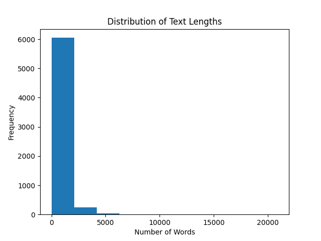
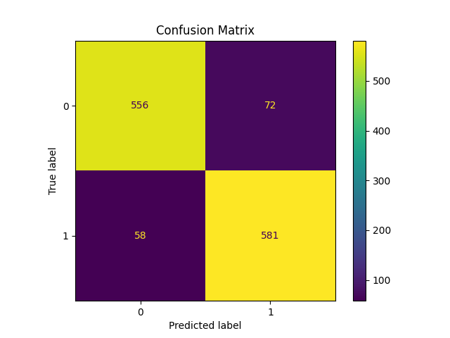
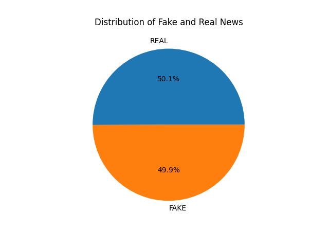
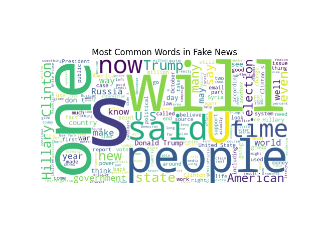

<h1 align="center">📰 Fake News Detection using Machine Learning 🤖</h1>

<h2>📌 Project Overview</h2>

This project focuses on detecting whether a news article is
<b>Fake</b> or <b>Real</b> using Machine Learning and Natural Language Processing (NLP).
The model is trained using a Fake News dataset and implemented using the
Multinomial Naive Bayes algorithm.

The project demonstrates how Artificial Intelligence can help identify
misleading information by analysing textual patterns present in news articles.

<h2>❗ Problem Statement</h2>

With the rapid growth of social media and digital platforms,
fake news spreads faster than ever before.

Misinformation can influence:

<ul>
<li>🗳️ Public opinion</li>
<li>🏛️ Political decisions</li>
<li>🌍 Social harmony</li>
<li>🔎 Trust in online information</li>
</ul>

Traditional fact-checking methods are often slow and time-consuming.
This project aims to build a Machine Learning model capable of classifying
news articles as:

<ul>
<li>🚨 FAKE</li>
<li>✅ REAL</li>
</ul>

<h2>📂 Dataset Information</h2>

Dataset used:

Fake or Real News Dataset

<h3>🔗 Dataset Link</h3>

<a href="https://raw.githubusercontent.com/lutzhamel/fake-news/master/data/fake_or_real_news.csv" target="_blank">
Click Here to Open Dataset
</a>

<h3>📊 Dataset Details</h3>

<ul>
<li>📰 News article dataset</li>
<li>🏷️ Contains Fake and Real news labels</li>
<li>📄 Text-based classification dataset</li>
<li>🤖 Used for NLP and Machine Learning tasks</li>
</ul>

<h2>💻 Technologies Used</h2>

<ul>
<li>🐍 Python</li>
<li>📊 Pandas</li>
<li>🔢 NumPy</li>
<li>📉 Matplotlib</li>
<li>🧠 Scikit-learn</li>
<li>☁️ WordCloud</li>
<li>📒 Jupyter Notebook</li>
</ul>

<h2>🧠 Machine Learning Algorithm</h2>

<h3>Multinomial Naive Bayes</h3>

Multinomial Naive Bayes is a probabilistic machine learning algorithm
commonly used for text classification tasks such as:

<ul>
<li>📧 Spam Detection</li>
<li>😊 Sentiment Analysis</li>
<li>📰 Fake News Detection</li>
</ul>

The algorithm predicts probabilities based on the occurrence of words
within textual data.

<h2>⚙️ Project Workflow</h2>

<ol>
<li>📥 Import Libraries</li>
<li>📂 Load Dataset</li>
<li>🧹 Data Cleaning</li>
<li>📝 Text Preprocessing</li>
<li>🔢 Text Vectorization using CountVectorizer</li>
<li>✂️ Train-Test Split</li>
<li>🤖 Model Training using Naive Bayes</li>
<li>📈 Prediction</li>
<li>📊 Model Evaluation</li>
<li>🎨 Data Visualization</li>
</ol>

<h2>🧹 Data Preprocessing</h2>

<h3>Cleaning the Dataset</h3>

<ul>
<li>❌ Removed unnecessary columns</li>
<li>🗑️ Removed empty text rows</li>
<li>🏷️ Separated features and labels</li>
</ul>

<h3>🔤 Text Vectorization</h3>

CountVectorizer was used to convert textual news data into numerical vectors.

<pre>
CountVectorizer()
</pre>

<h2>📊 Data Visualizations</h2>

<ul>

<li><h3>📈 Text Length Distribution Histogram</h3></li>

   

<li><h3>🧩 Confusion Matrix</h3></li>

   

<li><h3>🥧 Fake vs Real News Distribution</h3></li>

   

<li><h3>☁️ Word Cloud Visualization</h3></li>

</ul>

These visualisations help in understanding:

<ul>
<li>📊 Dataset distribution</li>
<li>🎯 Prediction performance</li>
<li>🔍 Frequently occurring words in fake news articles</li>
<li>📝 Textual patterns in news data</li>
</ul>

<h2>🏆 Model Performance</h2>

<h3>✅ Model Accuracy: 93%+</h3>

<h3>📌 Evaluation Metrics</h3>

<ul>
<li>📈 Training Accuracy</li>
<li>📉 Testing Accuracy</li>
<li>📏 95% Confidence Interval</li>
<li>🧩 Confusion Matrix</li>
</ul>

<h2>📐 Confidence Interval</h2>

A 95% confidence interval was calculated to estimate the reliability
and uncertainty of the model accuracy using statistical sampling theory.

<h2>📄 Project Presentation</h2>

The complete project presentation explaining the workflow,
problem statement, implementation, and evaluation can be viewed below:

<a href="https://github.com/Meghana-P15/ML-fake_news_detection/blob/main/aI.pdf" target="_blank">
📎 View Project Presentation PDF
</a>

<h2>⚡ Installation</h2>

<pre>
pip install numpy pandas matplotlib scikit-learn wordcloud
</pre>

<h2>▶️ How to Run</h2>

<ol>
<li>📥 Download the dataset</li>
<li>📒 Open Jupyter Notebook</li>
<li>▶️ Run all cells</li>
<li>🤖 Train the Naive Bayes model</li>
<li>📊 View predictions and visualizations</li>
</ol>

<h2>📁 Project Structure</h2>

<pre>
Fake-News-Detection/
│
├── FakeNews.ipynb
├── README.md
├── FakeNewsPresentation.pdf
│── histogram.png
│── ConfusionMatrix.png
│── ValueCount.png
│── WordCloud.png

</pre>

<h2>🎯 Key Learnings</h2>

<ul>
<li>🧠 Natural Language Processing (NLP)</li>
<li>🔢 Text Vectorization</li>
<li>📊 Naive Bayes Classification</li>
<li>📈 Machine Learning Evaluation Metrics</li>
<li>📐 Confidence Interval Calculation</li>
<li>🎨 Data Visualization</li>
<li>🤖 Fake News Detection using AI</li>
</ul>

<h2>🚀 Future Improvements</h2>

<ul>
<li>📌 TF-IDF Vectorization</li>
<li>📊 Logistic Regression</li>
<li>🧠 Support Vector Machine (SVM)</li>
<li>🤖 Deep Learning Models</li>
<li>🧬 BERT for advanced NLP tasks</li>
<li>🌐 Deploy using Streamlit or Flask</li>
</ul>

<h2>👨‍🏫 Guided By</h2>

G Santosh Kumar

<h2>👥 Team Members</h2>

<ul>
<li>Rithika M L</li>
<li>P Meghana</li>
</ul>

<h2>📌 Conclusion</h2>

This project demonstrates how Machine Learning and NLP techniques can be
used to identify fake news articles with strong accuracy.
The model highlights how probabilistic classification and textual analysis
can assist in combating misinformation in the digital era.

